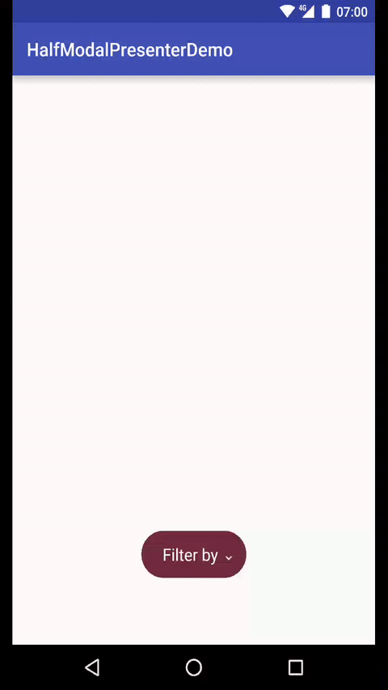

# IWAHalfModalPresenter
Simple modal presenter that can be easily customized

The modal will be shown in the bottom half part of the screen

This implementation is inspired by [Georg Bednorz's animation](https://dribbble.com/shots/2886287-Wireframe-Fab-Animation)



##Usage

First, add gradle dependency with command:<br>
```groovy
dependencies {
    compile 'com.inandwin.halfmodalpresenter:halfmodalpresenter:0.0.4'
}
``` 

Inside your fragment/activity layout, just add 3 views (example below) :
* An HalfModalView that will contain your button/expanding views
* An HalfModalTriggerView that matches your trigger button
* An HalfModalExpandedView that contain the content you want to show

HalfModalTriggerView and HalfModalExpandedView both inherits of LinearLayout, so you can adjust the orientation of this ViewGroups as you want to

```xml
<com.inandwin.halfmodalpresenter.HalfModalView
        android:id="@+id/halfModal"
        android:layout_width="wrap_content"
        android:layout_height="wrap_content"
        app:backgroundButtonExpanded="@color/other"
        app:backgroundButtonTrigger="@color/other">
        <com.inandwin.halfmodalpresenter.HalfModalTriggerView
            android:layout_width="wrap_content"
            android:layout_height="wrap_content"
            android:background="@color/other">
        </com.inandwin.halfmodalpresenter.HalfModalTriggerView>
        <com.inandwin.halfmodalpresenter.HalfModalExpandedView
            android:layout_width="wrap_content"
            android:layout_height="wrap_content"
            android:background="@color/other">
        </com.inandwin.halfmodalpresenter.HalfModalExpandedView>
    </com.inandwin.halfmodalpresenter.HalfModalView>
```

##Customization

The animation is splitted in two parts :
* Trigger button becomes smaller and move a little bit to the top
* Expanded view appears like an explosion

You can change these two backgrounds in layout:

```xml
app:backgroundButtonExpanded="@color/other"
app:backgroundButtonTrigger="@color/other"
```

Or programmatically:

```java
HalfModalView hfm = (HalfModalView) findViewById(R.id.halfModal);
hfm.setBackgroundButtonTrigger(ContextCompat.getDrawable(this, R.color.other));
hfm.setBackgroundButtonExpanded(ContextCompat.getDrawable(this, R.color.other));
```

If you need to show move the button to another part of the screen, you can adjust his position via :
```xml
app:positionFromTop="0.8"
```
```java
hfm.setPositionFromTop(0.8f);
```


## License

    Copyright 2016 In&Win

    Licensed under the Apache License, Version 2.0 (the "License");
    you may not use this file except in compliance with the License.
    You may obtain a copy of the License at

       http://www.apache.org/licenses/LICENSE-2.0

    Unless required by applicable law or agreed to in writing, software
    distributed under the License is distributed on an "AS IS" BASIS,
    WITHOUT WARRANTIES OR CONDITIONS OF ANY KIND, either express or implied.
    See the License for the specific language governing permissions and
    limitations under the License.
